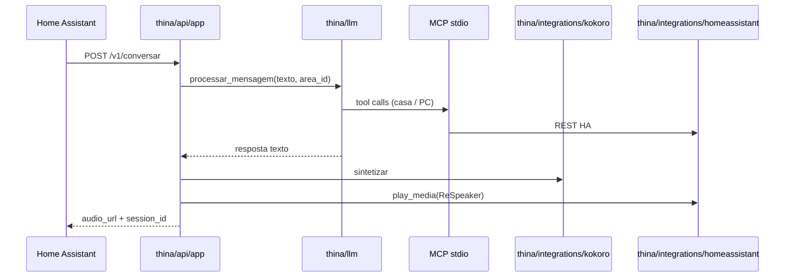

# Thina Server — guia para agentes (IDE / Cursor)

Assistente de voz residencial: **Home Assistant (STT)** → **este servidor (LLM + MCP)** → **Kokoro TTS** → **ReSpeaker via HA**.

## Onde começar

| Tarefa | Arquivo / pasta |
|--------|-----------------|
| Endpoint principal `POST /v1/conversar` | `thina/api/app.py` |
| Painel WebGL (UI) | `ui/` → build → `/ui/` no FastAPI |
| Variáveis de ambiente e caminhos | `thina/core/config.py` (`.env` na raiz) |
| Fluxo LLM + ferramentas MCP | `thina/llm/gemini_mcp.py` (`processar_mensagem`) |
| DeepSeek (provider alternativo) | `thina/llm/deepseek.py` |
| Servidor MCP stdio (subprocess) | `thina/llm/gemini_mcp.py` — `python -m thina.llm.gemini_mcp` |
| Home Assistant REST | `thina/integrations/homeassistant.py` |
| Síntese de voz Kokoro | `thina/integrations/kokoro.py` |
| Personalidade / contexto do usuário | `thina/context/user.py` + `maps/` |
| Apps e sites no PC Windows | `thina/pc/actions.py` + `maps/pc_apps.json` |
| Controle Spotify (teclas de mídia) | `thina/pc/spotify.py` |
| Histórico multi-turno (`session_id`) | `thina/core/conversation.py` |
| Texto limpo para TTS | `thina/speech/normalize.py` |

**Entrada em produção:** `main.py` reexporta `thina.api.app:app` (uvicorn `main:app`).

## Fluxo de uma requisição



## Layout do repositório

```
thina-server/
├── AGENTS.md              ← este arquivo
├── main.py                ← entrada uvicorn (shim)
├── config.py              ← shim → thina.core.config
├── thina/                 ← código Python (pacote principal)
│   ├── api/               HTTP FastAPI
│   ├── core/              config, conversação
│   ├── context/           mapas markdown do usuário
│   ├── speech/            normalização TTS
│   ├── integrations/      HA, Kokoro
│   ├── llm/               Gemini, DeepSeek, MCP
│   └── pc/                Windows: apps, Spotify
├── services/              ← shims legados (não editar lógica aqui)
├── maps/                  dados: áreas, apps PC, contexto
├── data/audio/            WAV temporários (gitignore)
├── tests/
│   ├── api/               testes do endpoint HTTP
│   └── unit/              testes por domínio (espelha thina/)
├── scripts/               start/stop stack, testes manuais
└── docs/                  integração HA, relatórios
```

## Configuração relevante

- **`.env`** na raiz — chaves LLM, URLs HA/Kokoro, `THINA_PUBLIC_URL` (URL que o HA usa para baixar WAV).
- **`maps/areas.json`** — `area_id` → `media_player.*` (ReSpeaker por cômodo).
- **`maps/thina_user.md`** + **`maps/private/*.md`** — contexto injetado no system prompt.
- **`LLM_PROVIDER`**: `gemini` | `deepseek`.
- **`MCP_SERVER_MODULE`**: padrão `thina.llm.gemini_mcp` (legado: `services.gemini_mcp`).

## Testes

```powershell
pip install -r requirements-dev.txt
pytest
```

Fixtures em `tests/conftest.py`. Não exige HA, Kokoro nem chaves reais (mocks).

## Compatibilidade

Imports antigos (`from config import …`, `from services.ha_client import …`) continuam via **shims** em `config.py` e `services/`. Código novo deve usar `thina.*`.

## O que não alterar sem motivo

- Contrato JSON de `/v1/conversar` (cliente Home Assistant).
- Caminhos padrão `maps/`, `data/audio/` (relativos à raiz do repo).
- Nomes das ferramentas MCP expostas ao LLM (quebram prompts existentes).
