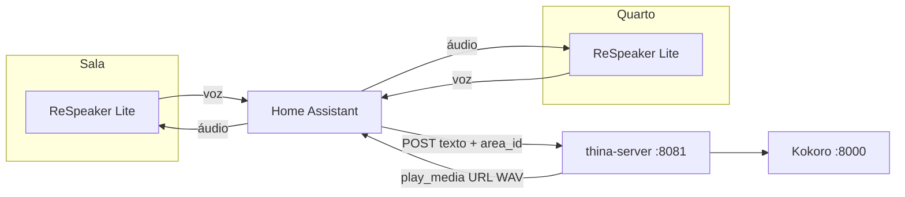

# Integração — Seeed ReSpeaker Lite Voice Assistant Kit (um por cômodo)

Guia para ligar vários **ReSpeaker Lite Voice Assistant Kit** ao **thina-server**, usando o Home Assistant como ponte (STT no satélite → Thina → áudio no mesmo satélite).

Relacionado: [relatorio-fluxo-servicos.md](./relatorio-fluxo-servicos.md)

---

## O que o kit faz no ecossistema Thina

| Função | Quem faz |
|--------|----------|
| Microfone + wake word | ReSpeaker Lite (ESPHome / satélite Assist) |
| STT (Whisper) | Pipeline de voz do Home Assistant |
| Inteligência + casa (Gemini/MCP) | **thina-server** |
| TTS (voz da Thina) | **Kokoro** (via Thina) |
| Altifalante | ReSpeaker Lite (`media_player` no HA) |

O Thina **não** configura o hardware Seeed diretamente. Só precisa que o HA envie `texto` + `area_id` e que exista um `media_player` por cômodo.

---

## Arquitetura (N cômodos)



---

## Fase 1 — Hardware e firmware (por aparelho)

Repita **uma vez por cômodo**.

### 1.1 Flash ESPHome (primeira vez)

1. Abra o instalador Seeed/ESPHome (documentação do kit: cartão QR ou [ESPHome Web](https://web.esphome.io)).
2. Ligue o ReSpeaker Lite via USB e grave o firmware **Voice Assistant** / **Home Assistant** (não o firmware “genérico” sem Assist, se houver opção).
3. Configure **Wi‑Fi** (SSID e senha) durante o flash ou no portal captivo após boot.

### 1.2 Adicionar ao Home Assistant

1. **Definições → Dispositivos e serviços → ESPHome → Adicionar dispositivo**.
2. O satélite deve aparecer online (ex.: `respeaker-lite-sala.local`).
3. **Definições → Áreas** → crie ou escolha a área (ex.: **Sala**) e **atribua o dispositivo** a essa área.

### 1.3 Registar como satélite de voz

1. **Definições → Assistentes de voz**.
2. **Adicionar satélite** (ou “Add satellite”) e selecione o dispositivo ESPHome do ReSpeaker.
3. Associe o satélite à **mesma área** (Sala, Quarto, etc.).
4. No pipeline de voz, use **Whisper** (local ou Wyoming) para STT — alinhado ao que o README do thina-server assume.

> **Dica:** Dê um nome claro ao dispositivo no HA (ex. `ReSpeaker Sala`) para achar as entidades depois.

### 1.4 Anotar entidades no HA

**Ferramentas de programador → Estados**, filtrar pelo dispositivo:

| Procurar | Exemplo | Uso no Thina |
|----------|---------|----------------|
| `media_player.*` | `media_player.respeaker_lite_sala` | Saída de áudio (`maps/areas.json`) |
| Dispositivo / área | Área “Sala” → `area_id` interno | Campo `area_id` no POST |

Teste de som no HA (antes do Thina):

- **Desenvolvedor → Serviços** → `media_player.play_media` com o `entity_id` do ReSpeaker e um URL de teste, ou TTS nativo do HA no mesmo `entity_id`.

---

## Fase 2 — Mapa no thina-server

Edite [`maps/areas.json`](../maps/areas.json). A **chave** deve ser o identificador de área que o HA enviará; o **valor** é o `media_player` real:

```json
{
  "sala": "media_player.respeaker_lite_sala",
  "quarto": "media_player.respeaker_lite_quarto",
  "cozinha": "media_player.respeaker_lite_cozinha"
}
```

Substitua pelos `entity_id` que viu no passo 1.4.

Reinicie o Thina após alterar o mapa (ou reinicie o processo `python main.py`).

---

## Fase 3 — Rede e `.env` do Thina

O Home Assistant precisa **baixar o WAV** gerado pelo Thina.

| Cenário HA | `THINA_PUBLIC_URL` |
|------------|-------------------|
| HA em Docker no mesmo PC do Thina | `http://host.docker.internal:8081` |
| HA noutro host na LAN | `http://<IP-do-PC-Thina>:8081` |

Exemplo `.env`:

```env
THINA_PORT=8081
THINA_PUBLIC_URL=http://192.168.1.50:8081
HOME_ASSISTANT_URL=http://homeassistant.local:8123
HOME_ASSISTANT_TOKEN=<token long-lived>
KOKORO_SERVER_URL=http://localhost:8000
```

**Teste de rede (no host do HA):** abrir no browser  
`http://<THINA_PUBLIC_URL>/health`  
→ deve devolver `{"status":"ok","service":"thina"}`.

---

## Fase 4 — Home Assistant → Thina

### 4.1 `rest_command`

Crie `config/packages/thina.yaml` (ou em `configuration.yaml`):

```yaml
rest_command:
  thina_conversar:
    url: "http://192.168.1.50:8081/v1/conversar"
    method: POST
    headers:
      Content-Type: "application/json"
    content_type: "application/json"
    payload: >
      {
        "texto": {{ texto | tojson }},
        "area_id": {{ area_id | tojson }}
      }
```

Ajuste o IP/porta. Em `configuration.yaml`:

```yaml
homeassistant:
  packages: !include_dir_named packages
```

### 4.2 Automação — quando o pipeline de voz terminar (recomendado)

Quando o utilizador fala no ReSpeaker, o HA corre o pipeline Assist e gera STT. No fim, dispare o Thina com o **cômodo do satélite**.

```yaml
automation:
  - id: thina_apos_stt
    alias: Thina - processar voz do satelite
    mode: queued
    max: 5
    trigger:
      - platform: event
        event_type: assist_pipeline_end
    condition:
      # Só processar se houve texto reconhecido
      - condition: template
        value_template: "{{ trigger.event.data.get('stt_output', {}).get('text', '') | length > 0 }}"
    action:
      - variables:
          texto: "{{ trigger.event.data.stt_output.text }}"
          # area_id do dispositivo que iniciou o pipeline (satélite ReSpeaker)
          device_id: "{{ trigger.event.data.device_id }}"
          area_slug: "{{ area_id(device_id) if device_id else 'sala' }}"
      - action: rest_command.thina_conversar
        data:
          texto: "{{ texto }}"
          area_id: "{{ area_slug }}"
```

**Importante sobre `area_slug`:**

- No HA, cada **área** tem um ID interno (ex.: `sala`, `quarto`). As chaves em `maps/areas.json` devem **coincidir**.
- Se `area_id(device_id)` devolver vazio, o satélite não está numa área → atribua área ao dispositivo nas definições.
- Se o ID da área no HA for diferente (ex. `sala_1`), ou altera a área no HA ou adiciona essa chave no JSON.

### 4.3 Alternativa — uma automação por ReSpeaker (mais simples)

Se o template de área falhar, use um trigger por dispositivo:

```yaml
automation:
  - alias: Thina - ReSpeaker Sala
    trigger:
      - platform: event
        event_type: assist_pipeline_end
        event_data:
          device_id: "abc123def456..."   # ID do dispositivo (Definições → Dispositivo → ⋮ → ID)
    condition:
      - condition: template
        value_template: "{{ trigger.event.data.get('stt_output', {}).get('text', '') | length > 0 }}"
    action:
      - action: rest_command.thina_conversar
        data:
          texto: "{{ trigger.event.data.stt_output.text }}"
          area_id: "sala"
```

Copie para `quarto`, `cozinha`, etc., com `area_id` fixo correto.

### 4.4 Evitar resposta dupla (Assist nativo + Thina)

Se o pipeline Assist ainda responder com TTS/LLM padrão do HA **e** o Thina falar ao mesmo tempo:

1. Crie um **pipeline de voz** usado só pelos satélites ReSpeaker com:
   - STT: Whisper (ou o que usar)
   - **Sem** agente de conversação cloud, **ou**
   - Agente “dummy” / pipeline mínimo
2. Ou desative a etapa de resposta automática nas opções do satélite (conforme versão do HA).

Objetivo: o pipeline termina em STT → automação chama Thina → Thina faz `play_media` no `media_player` do ReSpeaker.

---

## Fase 5 — Desativar TTS padrão no satélite (opcional)

Enquanto valida o Thina, pode manter o Kokoro como única voz de resposta. No pipeline Assist dos ReSpeakers:

- Não use Piper/OpenAI TTS do HA para respostas finais nos satélites Thina.
- A resposta audible vem sempre de `play_media` com URL do Thina (passo automático no servidor).

---

## Fase 6 — Checklist por cômodo

| # | Verificação |
|---|-------------|
| 1 | ReSpeaker online no ESPHome |
| 2 | Satélite de voz ligado à área correta |
| 3 | `media_player` toca teste no HA |
| 4 | Entrada em `maps/areas.json` |
| 5 | `curl` ou `scripts/test_app.py` com `area_id` certo → som no aparelho certo |
| 6 | Falar no quarto → automação envia `area_id` do quarto (não da sala) |
| 7 | `THINA_PUBLIC_URL` acessível pelo host do HA |

### Teste manual (sem microfone)

```powershell
curl -X POST http://127.0.0.1:8081/v1/conversar `
  -H "Content-Type: application/json" `
  -d '{"texto":"ola thina, teste no quarto","area_id":"quarto"}'
```

Deve ouvir-se no ReSpeaker do quarto e ver `"media_player": "media_player...._quarto"` na resposta JSON.

---

## Resolução de problemas

| Sintoma | O que verificar |
|---------|-----------------|
| Sem som, JSON OK | `THINA_PUBLIC_URL` no HA; firewall no PC do Thina |
| `area_id desconhecido` | Chave em `maps/areas.json` ≠ `area_id` enviado pela automação |
| Resposta sempre num cômodo | Automação com `area_id` fixo errado; satélite sem área no HA |
| 502 Bearer / HA | `HOME_ASSISTANT_TOKEN` no `.env` do processo Thina |
| Wake word sem reação | Satélite/pipeline Assist; ESPHome logs |
| Duas vozes (HA + Thina) | Ajustar pipeline (secção 4.4) |

---

## Ordem sugerida de implementação

1. **Um** ReSpeaker (ex. sala) — firmware → HA → `media_player` → teste `play_media`.
2. Thina + Kokoro + `maps/areas.json` + teste `curl`.
3. `rest_command` + automação `assist_pipeline_end`.
4. Validar voz ponta a ponta na sala.
5. Replicar firmware + área + linha no JSON para quarto e cozinha.
6. Afinar `area_id` e pipeline para não haver resposta dupla.

---

## Referências no repositório

| Ficheiro | Conteúdo |
|----------|----------|
| [maps/areas.json](../maps/areas.json) | Cômodo → `media_player` |
| [README.md](../README.md) | API `/v1/conversar` |
| [relatorio-fluxo-servicos.md](./relatorio-fluxo-servicos.md) | Entradas/saídas por serviço |
| [scripts/test_app.py](../scripts/test_app.py) | Teste integrado |

Documentação Seeed (hardware): consulte o manual do **ReSpeaker Lite Voice Assistant Kit** (QR na caixa) para URLs atualizados de firmware e ESPHome.
