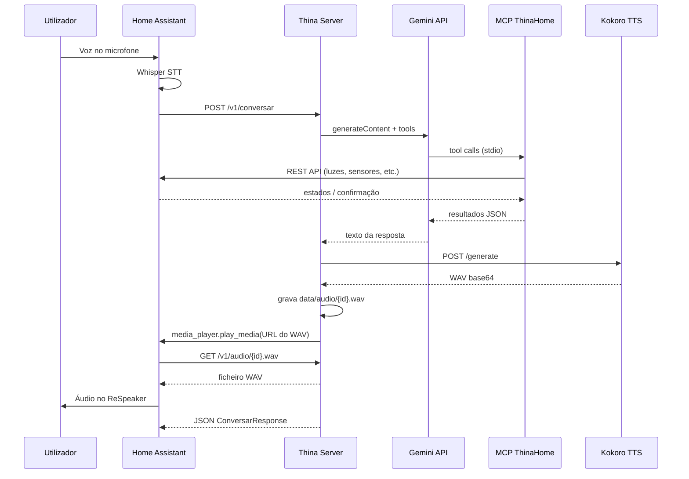
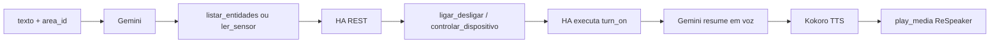

# Relatório — Fluxo do assistente Thina (entradas e saídas por serviço)

Documento de referência com exemplos reais de como o **thina-server** integra Home Assistant, Gemini+MCP, Kokoro TTS e reprodução no ReSpeaker.

**Data do teste de referência:** 27/05/2026  
**Comando de validação:** `python scripts/test_app.py`  
**Ambiente:** Windows, Thina na porta `8081` (`.env`), Kokoro em `:8000`, HA em `:8123`

---

## 1. Visão geral da arquitetura

O utilizador fala num cômodo; o Home Assistant transcreve o áudio (Whisper STT) e envia **texto + cômodo** ao servidor Thina. O Thina responde em voz no altifalante (ReSpeaker) daquele cômodo.



---

## 2. Mapa de portas e URLs

| Serviço | Porta / URL típica | Função |
|---------|-------------------|--------|
| **Thina** | `http://0.0.0.0:8081` | API central FastAPI |
| **Thina (pública para HA)** | `THINA_PUBLIC_URL` → ex. `http://host.docker.internal:8081` | URL que o HA usa para **baixar** o WAV |
| **Kokoro TTS** | `http://localhost:8000` | Síntese de voz |
| **Home Assistant** | `http://localhost:8123` | Casa inteligente + `play_media` |

**Mapa cômodo → altifalante** (`maps/areas.json`):

```json
{
  "sala": "media_player.respeaker_sala",
  "quarto": "media_player.respeaker_quarto",
  "cozinha": "media_player.respeaker_cozinha"
}
```

---

## 3. Serviço 1 — Home Assistant (origem e destino final)

### 3.1 Entrada (STT → Thina)

Após o Whisper, o HA chama o `rest_command` (ou automação equivalente):

**HTTP:** `POST {THINA_URL}/v1/conversar`  
**Headers:** `Content-Type: application/json`

**Corpo (exemplo):**

```json
{
  "texto": "ola thina, responda em uma frase curta de boas vindas.",
  "area_id": "sala",
  "session_id": null
}
```

| Campo | Tipo | Descrição |
|-------|------|-----------|
| `texto` | string | Texto transcrito (obrigatório) |
| `area_id` | string | Chave do `maps/areas.json` (ex. `sala`) |
| `session_id` | string \| null | Reservado para histórico multi-turno |

### 3.2 Saída (resposta HTTP ao HA)

**HTTP:** `200 OK`  
**Corpo (exemplo do teste de 27/05/2026):**

```json
{
  "resposta": "Olá! Em que posso ajudar?",
  "audio_url": "http://host.docker.internal:8081/v1/audio/c1e135b53d7e484e88fba756b5320cc3.wav",
  "area_id": "sala",
  "media_player": "media_player.respeaker_sala"
}
```

O Thina **também** dispara `play_media` no HA; o JSON acima é sobretudo para logging/automações.

### 3.3 Download do áudio (HA → Thina)

Quando o HA executa `media_player.play_media`, ele faz:

**HTTP:** `GET {THINA_PUBLIC_URL}/v1/audio/{audio_id}.wav`

**Exemplo:** `GET http://host.docker.internal:8081/v1/audio/c1e135b53d7e484e88fba756b5320cc3.wav`

| Resposta | Conteúdo |
|----------|----------|
| `200 OK` | Ficheiro `audio/wav` (~84 KB no teste curto) |
| `404` | `{"detail":"Audio nao encontrado"}` |

### 3.4 Chamada interna — reproduzir no ReSpeaker

O módulo `ha_client.py` envia ao HA:

**HTTP:** `POST /api/services/media_player/play_media`  
**Headers:** `Authorization: Bearer <HOME_ASSISTANT_TOKEN>`

**Corpo (exemplo):**

```json
{
  "entity_id": "media_player.respeaker_sala",
  "media_content_id": "http://host.docker.internal:8081/v1/audio/c1e135b53d7e484e88fba756b5320cc3.wav",
  "media_content_type": "music",
  "announce": true
}
```

**Log observado (execução anterior):**

```text
Reproduzindo audio em media_player.respeaker_sala: http://192.168.1.100:8080/v1/audio/08963dd5648546aea5abf279c86c3f51.wav
```

> `THINA_PUBLIC_URL` deve ser um endereço que o **host do HA** alcança (não use `localhost` se o HA estiver em Docker noutra máquina).

---

## 4. Serviço 2 — Thina Server (FastAPI)

### 4.1 Health check

**Entrada:** `GET /health`

**Saída (exemplo):**

```json
{
  "status": "ok",
  "service": "thina"
}
```

### 4.2 Pipeline interno de `POST /v1/conversar`

| Etapa | Módulo | Entrada | Saída |
|-------|--------|---------|-------|
| 1 | `main.py` | `area_id` | `media_player` via `maps/areas.json` |
| 2 | `gemini_mcp.py` | `texto`, `area_id` | `resposta_texto` (string) |
| 3 | `tts_kokoro.py` | `resposta_texto` | `AudioResult` (ficheiro + URL pública) |
| 4 | `ha_client.py` | `media_player`, `audio.public_url` | comando `play_media` no HA |

**Log de arranque (exemplo):**

```text
Mapa de areas carregado: ['sala', 'quarto', 'cozinha']
Uvicorn running on http://0.0.0.0:8081
```

**Log de conversa (exemplo):**

```text
Conversa | area=sala | player=media_player.respeaker_sala | texto=ola thina, responda em uma frase curta de boas vindas.
```

### 4.3 Erros HTTP comuns

| Código | Causa típica | Exemplo de `detail` |
|--------|--------------|---------------------|
| `400` | `area_id` inválido | `area_id desconhecido: 'garagem'` |
| `502` | Kokoro ou HA inacessível | `Nao foi possivel ligar ao Home Assistant: ...` |
| `503` | Gemini/MCP falhou | `Falha ao processar mensagem com Gemini/MCP.` |

---

## 5. Serviço 3 — Gemini + MCP (inteligência e casa)

### 5.1 Entrada para o Gemini

O orquestrador `processar_mensagem()` monta o prompt do utilizador:

```text
Comodo atual (area_id): sala
Mensagem do usuario: ola thina, responda em uma frase curta de boas vindas.
```

**Chamada à API Google (resumo):**

- **URL:** `POST https://generativelanguage.googleapis.com/v1beta/models/gemini-2.5-flash:generateContent`
- **System instruction:** personalidade da Thina (português BR, respostas curtas para voz)
- **Tools:** ferramentas MCP expostas via subprocess stdio (`FastMCP` / servidor `ThinaHome`)

### 5.2 Ferramentas MCP (entrada/saída por tool)

Cada tool recebe parâmetros do Gemini e devolve **string JSON**.

#### `controlar_dispositivo`

| Entrada (args) | Exemplo |
|----------------|---------|
| `entity_id` | `light.sala` |
| `dominio` | `light` |
| `servico` | `turn_on` |
| `dados_json` | `{"brightness": 255}` |

| Saída (exemplo) |
|-----------------|
| `{"ok": true, "entity_id": "light.sala", "resultado": ...}` |

#### `ler_sensor`

| Entrada | `entity_id`: `sensor.temperatura_sala` |
| Saída | `{"entity_id":"...", "state":"22.5", "attributes":{...}}` |

#### `listar_entidades`

| Entrada | `dominio`: `light`, `area`: `sala` (opcionais) |
| Saída | `{"total": 3, "entidades": [{"entity_id":"light.sala", "state":"off", ...}]}` |

#### `ligar_desligar`

| Entrada | `entity_id`: `switch.fan`, `acao`: `ligar` \| `desligar` |
| Saída | `{"ok": true, "entity_id": "...", "acao": "ligar"}` |

### 5.3 Saída final do Gemini (para o TTS)

**Exemplos reais:**

| Pedido do utilizador | Texto devolvido | Tamanho (log) |
|----------------------|-----------------|---------------|
| `ola thina, como voce esta?` | (resposta cordial, ~46 caracteres) | 46 caracteres |
| `ola thina, responda em uma frase curta de boas vindas.` | `Olá! Em que posso ajudar?` | — |

**Log:**

```text
Processando mensagem com Gemini (gemini-2.5-flash) e MCP
HTTP Request: POST .../gemini-2.5-flash:generateContent "HTTP/1.1 200 OK"
Resposta Thina (46 caracteres)
```

Se o pedido exigir ação na casa, o Gemini pode fazer várias tool calls (AFC, até 10 chamadas remotas) antes de produzir a frase final falada.

---

## 6. Serviço 4 — Kokoro TTS

### 6.1 Listagem de vozes (diagnóstico)

**Entrada:** `GET http://localhost:8000/voices`

**Saída (resumo do teste):** `200 OK`, **13 vozes** disponíveis.

### 6.2 Síntese — `POST /generate`

**Entrada (enviada por `tts_kokoro.py`):**

```json
{
  "text": "Olá! Em que posso ajudar?",
  "voice": "af_heart",
  "speed": 1.0,
  "sentiment": "neutral"
}
```

Variáveis no `.env`: `KOKORO_VOICE`, `KOKORO_SPEED`, `KOKORO_SENTIMENT`.

**Saída (JSON do Kokoro):**

```json
{
  "audio": "<base64 do WAV>"
}
```

### 6.3 Processamento no Thina

| Passo | Resultado |
|-------|-----------|
| Decodifica base64 | bytes WAV |
| Grava em disco | `data/audio/{uuid}.wav` |
| Expõe URL | `{THINA_PUBLIC_URL}/v1/audio/{uuid}.wav` |

**Exemplos reais:**

| Texto sintetizado | Ficheiro | Tamanho |
|-------------------|----------|---------|
| Resposta ~46 chars | `08963dd5648546aea5abf279c86c3f51.wav` | 146 476 bytes |
| `Olá! Em que posso ajudar?` | `c1e135b53d7e484e88fba756b5320cc3.wav` | 84 012 bytes |

**Log:**

```text
Sintetizando voz via Kokoro (46 caracteres)
HTTP Request: POST http://localhost:8000/generate "HTTP/1.1 200 OK"
Audio gerado: 08963dd5648546aea5abf279c86c3f51.wav (146476 bytes)
```

---

## 7. Fluxo ponta a ponta — exemplo cronológico

Cenário: teste manual `scripts/test_app.py` com pedido de boas-vindas na **sala**.

| # | Momento | Serviço | Entrada | Saída |
|---|---------|---------|---------|-------|
| 1 | t+0 ms | Cliente teste | — | `POST /v1/conversar` |
| 2 | t+~100 ms | Thina | resolve `sala` | `media_player.respeaker_sala` |
| 3 | t+~1–5 s | Gemini+MCP | texto + área | `Olá! Em que posso ajudar?` |
| 4 | t+~5–6 s | Kokoro | texto | WAV 84 012 bytes |
| 5 | t+~6–7 s | HA | `play_media` + GET WAV | áudio no ReSpeaker |
| 6 | t+~6,7 s | Thina → cliente | — | HTTP 200 + JSON `ConversarResponse` |

**Resumo do teste automatizado:**

```text
=== Thina /health ===
OK HTTP 200: {"status":"ok","service":"thina"}

=== Kokoro /voices ===
OK HTTP 200: 13 vozes

=== Home Assistant ===
OK HTTP 200

=== POST /v1/conversar ===
OK HTTP 200 em 6.7s
  resposta: Olá! Em que posso ajudar?
  audio_url: http://host.docker.internal:8081/v1/audio/c1e135b53d7e484e88fba756b5320cc3.wav
  media_player: media_player.respeaker_sala
  wav: 84012 bytes
```

---

## 8. Exemplo com ação na casa (fluxo estendido)

Pedido hipotético: *"liga a luz da sala"*



| Etapa | Entrada | Saída |
|-------|---------|-------|
| MCP → HA | `ligar_desligar(entity_id=light.sala, acao=ligar)` | `{"ok": true, ...}` |
| Gemini | resultados das tools | `"Pronto, liguei a luz da sala."` |
| Kokoro | frase acima | novo `{uuid}.wav` |
| HA | URL pública do WAV | luz ligada + áudio confirmando |

---

## 9. Configuração crítica (`.env`)

| Variável | Exemplo | Impacto |
|----------|---------|---------|
| `GEMINI_API_KEY` | *(segredo)* | Sem chave → `503` no `/v1/conversar` |
| `HOME_ASSISTANT_TOKEN` | *(segredo)* | Token vazio → `502` (`Bearer ` inválido) |
| `THINA_PORT` | `8081` | Porta do uvicorn |
| `THINA_PUBLIC_URL` | `http://host.docker.internal:8081` | URL no `play_media` |
| `KOKORO_SERVER_URL` | `http://localhost:8000` | TTS |

---

## 10. Notas operacionais

### Conflito de porta 8080 no Windows (WSL)

No `127.0.0.1:8080`, o **wslrelay** pode responder com 404 (Tomcat) em vez do Thina. O Python do Thina escuta em `0.0.0.0:8080`, mas pedidos a `localhost:8080` nem sempre chegam ao Thina.

**Mitigação usada:** `THINA_PORT=8081` e testes em `http://127.0.0.1:8081`.

### Retenção de áudio

Ficheiros em `data/audio/*.wav` são removidos após `AUDIO_RETENTION_HOURS` (padrão 24 h) no startup e após cada conversa.

### Como repetir o relatório

```powershell
cd thina-server
.\.venv\Scripts\Activate.ps1
python main.py
# noutro terminal:
python scripts\test_app.py
```

---

## 11. Referências no repositório

| Ficheiro | Responsabilidade |
|----------|------------------|
| `main.py` | Rotas `/health`, `/v1/conversar`, `/v1/audio/{id}.wav` |
| `config.py` | Settings e mapa de áreas |
| `services/gemini_mcp.py` | MCP tools + `processar_mensagem()` |
| `services/tts_kokoro.py` | Integração Kokoro |
| `services/ha_client.py` | Cliente REST do HA |
| `scripts/test_app.py` | Teste integrado dos quatro serviços |
| `maps/areas.json` | `area_id` → `media_player` |

---

*Relatório gerado com base em execuções reais do thina-server e logs em `data/thina-server.err.log`.*
